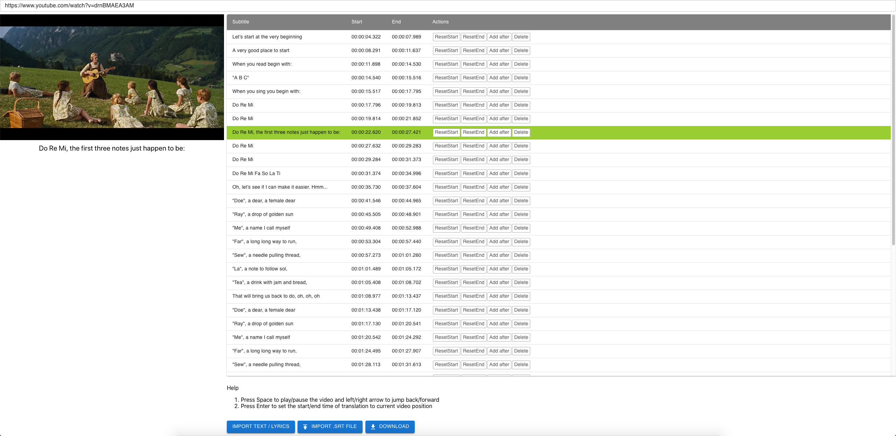

### Online video SRT creator (Minimum Viable Product state)
1. Enter your video url (currenly works for youtube)
2. Import your subtitles from a verses, lyrics, etc. (split them by line or paragraph)
3. While the video is playing, press Enter to add timings for your subtitles
4. Download your SRT file!

### More features
- End-time and start-time timings automatically join by 1ms if very close, for a fluent (no-flicker) flow

### Maybe in the future
- Be able to edit the subtitle
- Insert new translations before/after another
- Add abilty to offset timing for entire subtitle file
- Prevent video frame focus or create separate controls for it
